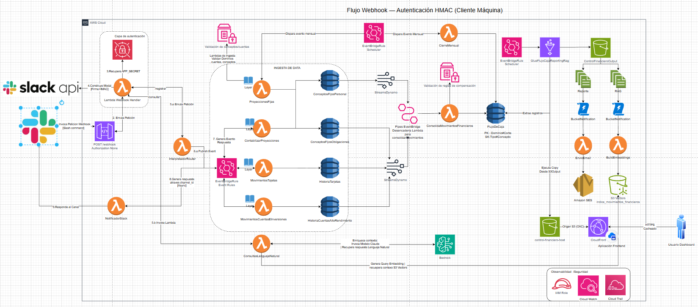

# Control Financiero Personal — Serverless AWS

Sistema de control financiero personal basado en eventos, desplegado completamente en AWS con Terraform. Permite registrar, consolidar y proyectar movimientos financieros (cuentas, tarjetas, inversiones y ahorros) con reglas de compensación automáticas. La interfaz principal es **Slack**, con un asistente IA integrado para consultas en lenguaje natural.

---

## Arquitectura



El sistema está construido sobre una arquitectura **event-driven serverless** donde cada componente reacciona a eventos publicados en un bus central de EventBridge. Los datos fluyen desde Slack → API Gateway → Lambdas → DynamoDB → Consolidación → Reportes → IA.

---

## Componentes AWS

| Recurso | Uso |
|---|---|
| **Lambda (12 funciones)** | Procesamiento de eventos, consolidación, notificaciones e IA |
| **DynamoDB (5 tablas)** | Almacenamiento de movimientos, conceptos fijos y flujo de caja |
| **API Gateway** | Endpoints REST para ingesta de movimientos y webhook de Slack |
| **EventBridge** | Bus central `bus-financiero` + Pipes desde DynamoDB Streams |
| **Glue Job** | Exportación diaria de DynamoDB a S3 con transformaciones Spark |
| **S3 (3 buckets)** | Frontend estático, reportes CSV y datos RAG |
| **CloudFront** | CDN para el frontend con OAC |
| **Cognito** | Autenticación con grupos `admin` y `general` |
| **OpenSearch** | Búsqueda vectorial (preparado para RAG) |
| **SES** | Envío de reportes por email |
| **SSM Parameter Store** | Catálogos financieros, reglas de compensación y proyecciones |
| **Secrets Manager** | Credenciales de Slack (webhook y bot token) |

---

## Flujo de Datos

```
Usuario en Slack (/registrar)
        │
        ▼
WebhookHandler ──► Modal dinámico con catálogo
        │
        ▼
InterpretadorRouters ──► EventBridge bus-financiero
        │
        ▼
Lambda especializada (Cuentas / Tarjetas / Proyecciones)
        │  Valida contra catálogo (SSM)
        ▼
DynamoDB (HistoriaTarjetas / HistoriaCuentasAltoRendimiento / ConceptosFijos*)
        │
        ▼  DynamoDB Stream → EventBridge Pipe
ConsolidaMovimientosFinancieros
        │  Aplica reglas de compensación (SSM)
        ▼
FlujoDeCaja (tabla consolidada)
        │
        ├──► NotificadorSlack (confirmación en Slack)
        │
        ▼  Glue Job (diario 20:00)
CSV + JSONL en S3
        │
        ├──► EnvioEmail (SES con URL prefirmada)
        └──► EmbeddingLambda (vectores con Amazon Titan)
                │
                ▼
        S3 Vectors (índice rag-index)
                │
                ▼  /consulta en Slack
        QueryRagEmbedding ──► Claude 3 Sonnet ──► Respuesta en Slack
```

---

## Lambdas

### Ingesta de movimientos
| Lambda | Descripción |
|---|---|
| `MovimientosCuentasEInversiones` | Registra movimientos de cuentas de alto rendimiento e inversiones. Valida dominio, cuenta y concepto contra el catálogo. Publica `movimiento.cuenta.confirmado`. |
| `MovimientosTarjetas` | Registra movimientos de tarjetas de crédito. Valida franquicia. Publica `movimiento.tarjeta.confirmado`. |
| `ParametrizarConceptosAhorro` | Registra conceptos fijos (gastos/ingresos proyectados). Enruta a `ConceptosFijosObligaciones` o `ConceptosFijosPersonal` según dominio. |

### Consolidación y cierre
| Lambda | Descripción |
|---|---|
| `ConsolidaMovimientosFinancieros` | Motor central. Escucha DynamoDB Streams de 4 tablas vía EventBridge Pipes. Aplica reglas de compensación desde SSM y actualiza `FlujoDeCaja`. |
| `CierreMensual` | Cron el 1° de cada mes. Calcula saldos finales y crea `SALDO_INICIAL` para el mes siguiente. |
| `ProyeccionesFijas` | Cron el 1° de cada mes. Carga proyecciones automáticas desde SSM y proyecta 3 meses adelante (idempotente). |

### Integración Slack
| Lambda | Descripción |
|---|---|
| `WebhookHandler` | Valida firma de Slack. Maneja slash commands `/registrar` y `/consulta`, construye modales dinámicos y enruta submissions. |
| `InterpretadorRouters` | Transforma el state del modal al payload correcto y publica el evento en EventBridge. |
| `NotificadorSlack` | Escucha eventos confirmados en EventBridge y envía notificaciones al canal de Slack. |

### IA y reportes
| Lambda | Descripción |
|---|---|
| `EmbeddingLambda` | Disparada por S3 al crear archivos JSONL en `output/rag/`. Genera embeddings con Amazon Titan y los inserta en S3 Vectors. |
| `QueryRagEmbedding` | Recibe pregunta desde Slack, busca vectores similares y genera respuesta con Claude 3 Sonnet. |
| `EnvioEmail` | Disparada por S3 al crear CSV en `output/reports/`. Envía email con SES con URL prefirmada (válida 2 horas). |

---

## Tablas DynamoDB

| Tabla | PK | Streams | Propósito |
|---|---|---|---|
| `HistoriaTarjetas` | `trx_id` | ✅ | Movimientos de tarjetas de crédito |
| `HistoriaCuentasAltoRendimiento` | `trx_id` | ✅ | Movimientos de cuentas e inversiones |
| `ConceptosFijosObligaciones` | `trx_id` | ✅ | Gastos fijos del hogar (dominio CASA) |
| `ConceptosFijosPersonal` | `trx_id` | ✅ | Gastos fijos personales |
| `FlujoDeCaja` | `Dominio-Corte` / `Tipo-Concepto` | ❌ | Consolidación final por período |

---

## Reglas de Compensación

Las reglas se almacenan en SSM (`/flujo-caja/reglas-compensacion`) y son evaluadas por `ConsolidaMovimientosFinancieros` en cada evento. Se cachean 5 minutos en memoria.

| Regla | Condición | Efecto |
|---|---|---|
| `CUENTA_DISMINUYE_GASTO` | Movimiento de cuenta con valor negativo | Disminuye gasto proyectado y saldo de cuenta |
| `MOV_TARJETA_REDUCE_PROYECCION` | Movimiento de tarjeta con valor positivo | Disminuye gasto proyectado e incrementa saldo de tarjeta |
| `INGRESO_HOGAR_DISMINUYE_PROYECCION` | Concepto "INGRESO HOGAR" con valor positivo | Disminuye proyección del mismo concepto e incrementa saldo |

---

## Glue Job

El job `export_dynamo_to_s3.py` se ejecuta diariamente a las 20:00 y realiza:

1. Lee `FlujoDeCaja` desde DynamoDB con Spark
2. Extrae dominio y corte de la clave compuesta `Dominio#Corte`
3. Ajusta signos (tarjetas en CAJA_ACTUAL → negativo, gastos en PROYECCION → negativo)
4. Genera tres salidas:
   - **CSV** en `s3://.../reports/` → dispara `EnvioEmail`
   - **JSONL** en `s3://.../rag/` → dispara `EmbeddingLambda`
   - **CSV** en bucket del frontend → disponible en CloudFront

---

## Dominios Financieros

El catálogo (`/flujo-caja/catalogo`) define los dominios válidos:

- **CASA** — Cuentas del hogar (BDO, KUBO, NEQUI, EFECTIVO), tarjetas y conceptos compartidos
- **PERSONAL** — Cuentas personales, conceptos de ahorro e ingresos individuales
- **AHORRO** — Cuentas de ahorro con metas específicas
- **INVERSIONES** — CDTs, acciones, monedas y cuentas de inversión

---

## Despliegue

### Prerrequisitos

- Terraform >= 1.5
- AWS CLI configurado con permisos suficientes
- Python 3.12 (para empaquetar layers)

### Inicializar estado remoto

```bash
cd terraform/modules/tf-state
terraform init
terraform apply
```

### Desplegar infraestructura

```bash
cd terraform
terraform init
terraform plan
terraform apply
```

### Variables principales

| Variable | Descripción |
|---|---|
| `project` | Nombre del proyecto (tag en todos los recursos) |
| `aws_region` | Región de despliegue |
| `ses_email` | Email verificado en SES para envío de reportes |

---

## Seguridad

- Roles IAM con permisos mínimos por Lambda
- Slack webhook validado por firma HMAC en cada request
- Credenciales de Slack en Secrets Manager (nunca en variables de entorno directas)
- API Gateway con autorización Cognito en todos los endpoints (excepto webhook público)
- CloudFront con OAC — el bucket S3 del frontend no es público
- Catálogos y reglas en SSM con cache en memoria para reducir latencia y costos
